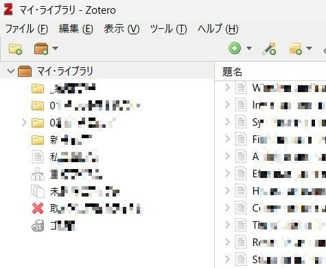
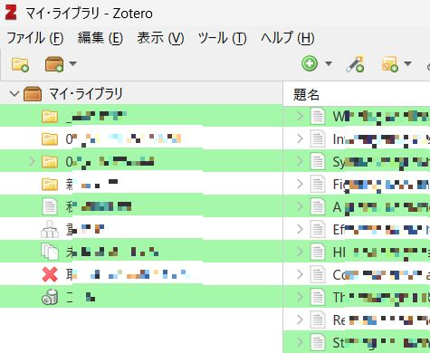

私が文献管理に使用しているZoteroは、オープンソースで開発されていることもあってか、ユーザーが独自のカスタマイズを施す余地が残されています。ここでは個人的な備忘録を兼ねて、ソフトウェアの見た目を変える方法の基本を整理します。

なお、以下の記述は、Windows 11 HomeにインストールされたZotero 6.0.30に対して適用したものをもとにしています。その他の組み合わせにおいて当てはまらない部分があり得ることはご容赦ください。

## 実現したいこと
<hr>

フォルダ（コレクション）と文献情報が表示される部分は、背景が白一色となっており、件数が増えると一つひとつを視認で区別するのがやや面倒に感じるようになります。そこで、Excelのテーブル機能や一部のメーラーに実装されているような、<b>1行ごとに背景色を変える</b>設定を何とか施したいと思いました。

## カスタマイズ方法
<hr>

Zoteroの見た目は、FirefoxやThunderbirdと同様に、カスタマイズ内容を記載したuserChrome.cssを所定の位置に配置することによって変更することができます。

DOM Inspectorのアドオンを用いてカスタマイズしたい箇所の要素名を調べるのが王道ですが、実際には少し手抜き（？）をしました。ほぼすべての部分をダークテーマに対応させる <a href="https://github.com/Rosmaninho/Zotero-Dark-Theme" target="_blank" rel="noopener">Rosmaninho/Zotero-Dark-Theme（※別タブで開きます）</a>を下敷きに、アプリケーション画面の左上にあるフォルダリストの部分と、中央にある文献情報リストの部分の背景色を手探りで特定して、変更を施すことにしました。この雑記では、試行錯誤の過程は脇に置いておいて、最終的なコードのみを記述します。

具体的な手順は、以下の通りです。
1. Zoteroが終了していることを確認する。
2. エクスプローラーで、Zoteroのユーザープロファイルフォルダを開く。\
標準では、C:\Users\ユーザ名\AppData\Roaming\Zotero\Zotero\Profiles\任意の文字列.default
3. 新規フォルダを作成し、chrome と命名する
4. chromeフォルダ内に新規ファイルを作成し、userChrome.css と命名する
5. userChrome.cssファイルをエディタで開き、以下のコードを追記して上書き保存する。
    ```
    /*change background and color of collections and items panes*/
    .virtualized-table .row:nth-child(odd) {
    	background: #ffffff;
    	color: #323234;
    }
    .virtualized-table .row:nth-child(even) {
    	background: #f5f7fa;
    	color: #323234;
    }
    ```
    
    .row:nth-child(odd)の記述が奇数行、.row:nth-child(even)の記述が偶数行に適用されます。backgroundは背景色、colorは文字色です。カラーコードはお好みのものに変更してください。
    
6. Zoteroを起動させ、コードが反映されていることを確認する。

## 実施前後の比較
<hr>
1枚目（左）が変更前、2枚目（右）が変更後のアプリケーション画面（一部）です。この画像では、変更した箇所が強調されるように、上述のコードとは異なる色の設定を行っています。

<div class="picflex">
    
    
</div>

## その他
<hr>

同様にCSSを記述すれば、今回設定したところ以外の箇所についても好みの背景色に変えることができます。また、未確認情報で申し訳ないのですが、フォントやサイズについても変更できる部分があるようです。