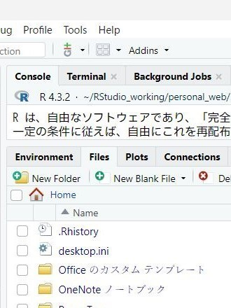
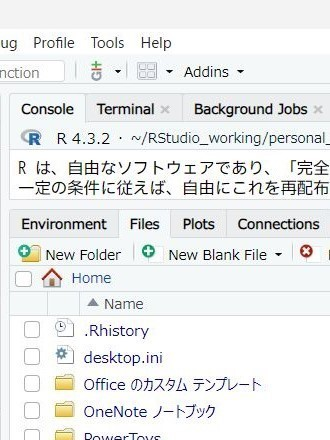

もうひとつ、個人的な備忘録を兼ねて、R言語の統合開発環境 (IDE) であるRStudioの見た目を変える方法も整理しておきたいと思います。

なお、以下の記述は、Windows 11 HomeにインストールされたRStudio 2023.12.0 Build369に対して適用したものをもとにしています。その他の組み合わせにおいて当てはまらない部分があり得ることはご容赦ください。

## 実現したいこと
<hr>

ファイル (Files) タブ内などの日本語表示が明朝体になっていて見づらいのが気になっていたので、<b>フォントの設定を変更したい</b>と思いました。スクリプトビューのフォントは設定画面から変えることができるものの、それ以外の部分については設定画面がないようです。何とかして変更できないものか、と。

## カスタマイズ方法
<hr>

どなたに教えていただいたのか失念してしまったのですが、Editor themeなるものをカスタマイズすることで変更が可能です。

具体的な手順は、以下の通りです。
1. RStudioで、現在適用されているテーマを確認する。\
Tools > Global Options > Appearance > Editor theme
2. エクスプローラーで、RStudioのテーマファイルの格納されたフォルダを開く。\
標準では、C:\Program Files\RStudio\resources\app\resources\themes？
3. 現在適用されているテーマと同名の.rsthemeファイルを複製し、任意の名称に変更する。
4. 3で作成したファイルをエディタで開き、冒頭の rs-theme-name のあとに続く部分を任意の呼称に書き換える。ここで指定した呼称が設定画面のEditor theme欄に表示されるので、既存のものと区別できるようにする必要があります。
5. 以下のコードを追記して上書き保存する。どの位置に追記しても問題ないようです。
    ```
    @font-face {
        font-family: "Segoe UI";
        src: local("Meiryo UI");
    }
    ```
    
    font-familyには変更したいフォント名、srcには置換候補のフォント名を記載します。Windows版の場合は Segoe UI のようです。置換候補のフォントは、local("abc"), local("def"); のように列挙することも可能で、この場合は前に記載されているものから順に、PC内にあるものが適用されます。ただし、フォントファミリー（sans-serif など）で指定することはできないようです。
    
6. RStudioで、作成したEditor themeを指定する。\
Tools > Global Options > Appearance > Editor theme
## 実施前後の比較
<hr>
1枚目（左）が変更前、2枚目（右）が変更後のアプリケーション画面（一部）です。これらの画像では、Textmateが使用されています。

<div class="picflex">
    
    
</div>

## その他
<hr>

.rsthemeファイルの実体はCSSのようですので、その他の部分についても要素名が分かればカスタマイズできそうです（未確認）。RStudioのウィンドウ内で右クリックして Inspect Element を選ぶと、インスペクターが起動して個別要素を確認できますので、それを参考にトライしてみるのも良いかもしれません。